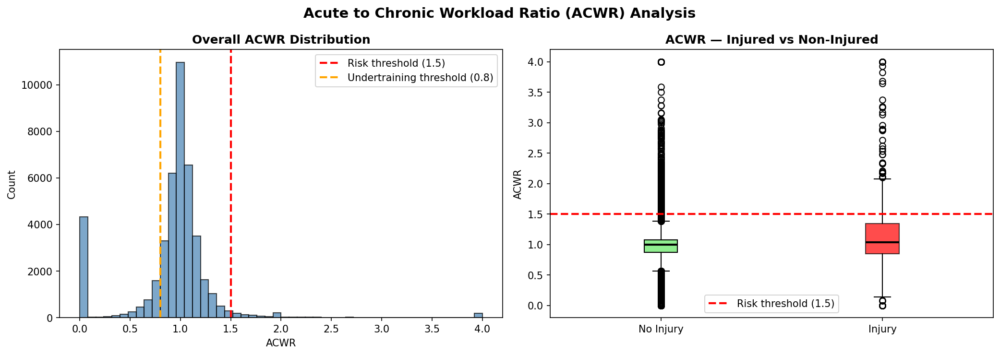
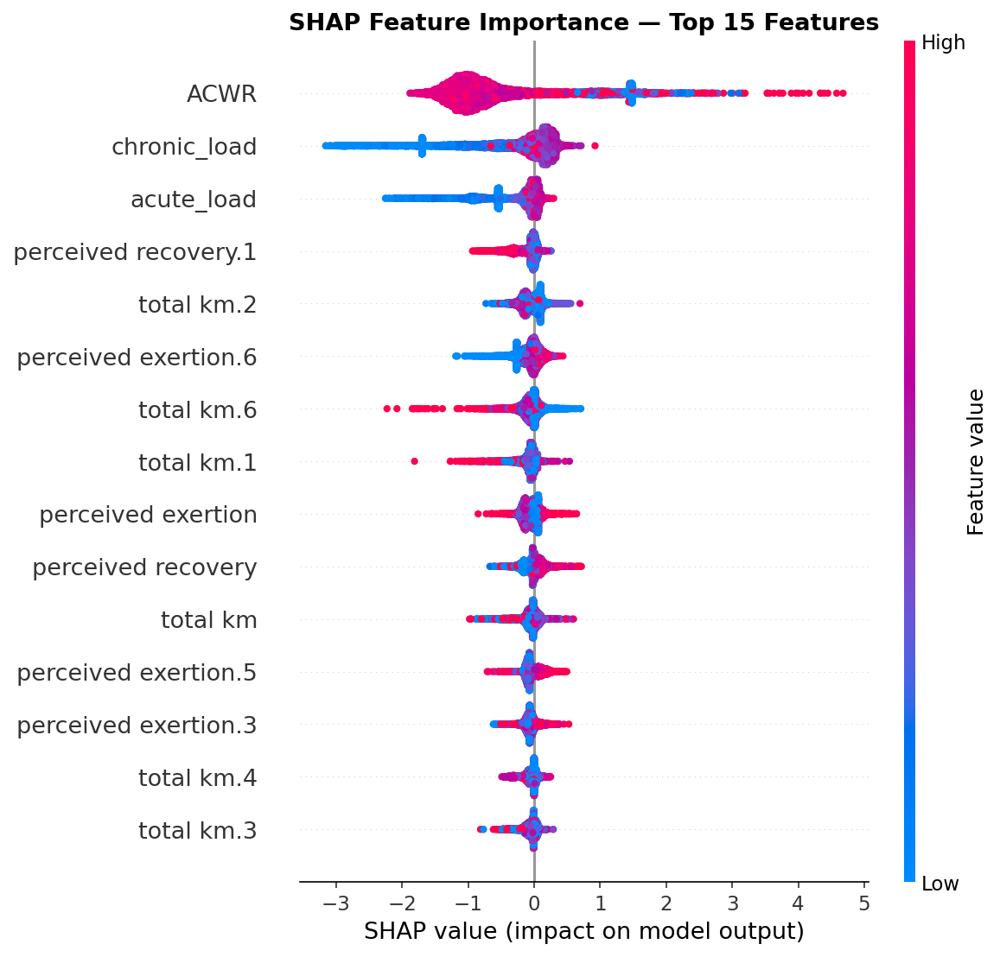
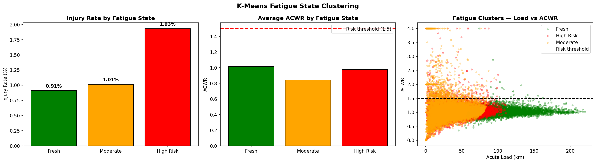

# Athlete Load Monitoring & Injury Risk Prediction
### Sports Performance Analytics | XGBoost | SHAP | K-Means

---

## Executive Summary

Injury prevention is one of the most critical challenges in elite sport. 
Using seven years of daily training data from 74 competitive Dutch distance 
runners, this project builds an end-to-end injury risk pipeline that 
identifies dangerous training patterns before injuries occur.

**Business Problem:** Coaching staff cannot identify which athletes are at injury 
risk without systematic data monitoring — athletes often feel fine right 
up until an injury occurs.

**Aim:** Build a pipeline that predicts injury risk from 7-day training 
windows and provides coaches with actionable monitoring signals.

**Method:** ACWR feature engineering, XGBoost classification, SHAP 
explainability, and K-Means fatigue state clustering.

**Key Finding:** Athletes training at an Acute to Chronic Workload Ratio 
(ACWR) >= 1.5 experience a 9x higher injury rate than those training within 
their conditioned baseline. The model achieves an AUC-ROC of 0.7483, 
confirming genuine ability to distinguish a high risk window. Counterintuitively, high volume 
athletes rarely exceed the 1.5 threshold — inconsistent and low activity 
athletes are structurally more vulnerable to training load spikes.

**Business Answer:** The ACWR threshold rule is the most reliable 
actionable output — flag any athlete exceeding 1.5 for immediate load 
reduction. The model serves as a supporting signal to prompt coaching 
review, not a standalone decision maker.

📊 **[View Full Deliverable (PDF)](Athlete_Load_Injury_Risk_Deliverable.pdf)**

---

## Business Problem

Overtraining is the most common cause of injury across endurance sports. 
When athletes spike their training load faster than their body can adapt, 
injury risk increases significantly — yet this risk is invisible without 
systematic monitoring.

The aim of this analysis is to use longitudinal training data to build a 
flagging system that identifies high-risk training windows before injury 
occurs, giving coaching and performance staff the evidence needed to 
intervene proactively.

---

## Dataset

**Lövdal et al. (2021)** — Dutch National Running Team (2012–2019)
*International Journal of Sports Physiology and Performance*

| File | Records | Columns |
|---|---|---|
| Daily training logs | 42,766 windows | 73 |
| Weekly summaries | 42,798 windows | 72 |

- 74 high-level middle and long distance runners
- Features: volume, intensity zones (Z3–Z5), sprinting, strength, 
  perceived exertion, perceived recovery, training success
  
---

## Methodology

**1. Exploratory Data Analysis**
Identified total km and subjective wellness metrics as the strongest 
signals differentiating injured from non-injured windows. High intensity 
zone metrics showed no conclusive difference between groups.

**2. Feature Engineering — ACWR**
Engineered the Acute to Chronic Workload Ratio using total km as the 
load metric. Acute load = sum of km across the 7-day window. Chronic 
load = rolling mean of the last 4 acute loads (~28 day baseline). 
ACWR = acute ÷ chronic.

**3. XGBoost Classifier**
Time-based train/test split (80/20) to prevent data leakage across 
overlapping windows. scale_pos_weight applied to handle 73:1 class 
imbalance. 300 trees, max depth 6, learning rate 0.05.

**4. SHAP Explainability**
Applied to identify which features drove individual predictions and 
validate the model's learned behaviour against domain knowledge.

**5. K-Means Fatigue Clustering**
Grouped all windows into three training load profiles without predefined 
labels. StandardScaler applied before clustering

---

## Key Findings

### ACWR & Injury Risk

Athletes training at ACWR >= 1.5 show a **9x higher injury rate** 
(9.04% vs 1.15%) compared to those within their conditioned baseline. 
ACWR was confirmed by SHAP as the single most dominant predictive feature.

### What Drives the Model

ACWR dominates all other features by a significant margin. chronic_load 
and acute_load rank second and third, validating the engineering decisions. 
Perceived exertion and recovery appear across multiple days within the 
window — the model reads the full 7-day pattern, not just one day.

### Fatigue State Clustering

K-Means identified three distinct training load profiles. The most 
significant finding — High Volume athletes rarely exceed the 1.5 ACWR 
threshold despite running 100km+ weeks. Their high chronic baseline makes 
dangerous load spikes structurally unlikely. Low Activity athletes need 
only a modest volume increase to produce a dangerous ACWR spike — making 
inconsistent training a greater injury risk factor than high volume 
consistent training.

---

## Results

| Metric | Value |
|---|---|
| AUC-ROC | 0.7483 |
| Injury Recall | 0.27 |
| Injury Precision | 0.26 |
| Default Threshold | 0.50 |

AUC of 0.7483 confirms the model learned genuine patterns — meaningfully 
better than random guessing (0.50). Recall of 0.27 reflects the extreme 
class imbalance rather than a modeling failure. Lowering the threshold 
to 0.30–0.35 would improve recall at the cost of more false alarms — 
a tradeoff for coaching staff to decide based on their tolerance for 
unnecessary rest days vs missed injuries.

---

## Recommendations

**Immediate rule — no model required:**
Flag any athlete whose ACWR exceeds 1.5 for load reduction. This single 
threshold captures the highest risk windows and is directly supported 
by a 9x injury rate increase.

**Monitor low activity and returning athletes closely:**
Their low chronic baseline makes them structurally more vulnerable to 
ACWR spikes than consistently high volume athletes.

**Use subjective wellness data alongside load metrics:**
Perceived exertion and recovery across the full window add meaningful 
injury signal beyond volume alone. An athlete reporting high exertion 
and low recovery consistently across a 7-day window warrants a coaching 
conversation regardless of ACWR value.

**Use the model as a supporting tool:**
The model flags elevated risk windows to prompt coach review — not to 
replace human judgment.

---

## Next Steps & Limitations

**Limitations:**
- Dataset limited to 74 elite distance runners — findings may not 
  transfer directly to team sport athletes or contact sports
- ACWR chronic load approximated from weekly rolling window rather 
  than true 28-day daily granularity
- ACWR built on total km only — intensity zones not incorporated 
  as separate load components
- Subjective wellness metrics are self-reported and subject to 
  response bias
- 1.36% injury rate creates a fundamental ceiling on recall 
  performance regardless of tuning

**Next Steps:**
- Incorporate HRV and sleep data for objective recovery signals
- Precision-recall threshold optimisation for specific coaching contexts

---

## Tools & Libraries

`Python` · `pandas` · `numpy` · `XGBoost` · `scikit-learn` · 
`SHAP` · `matplotlib` · `seaborn`

---
